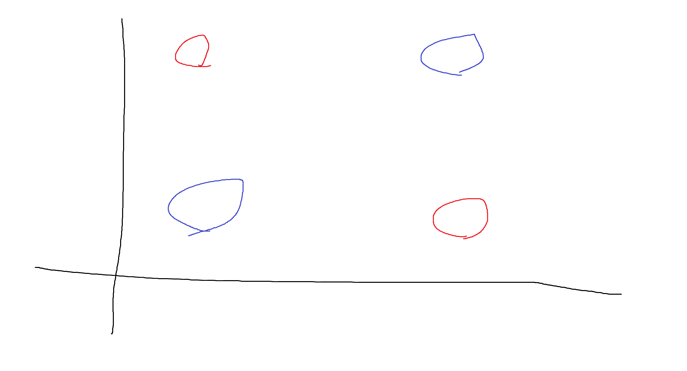
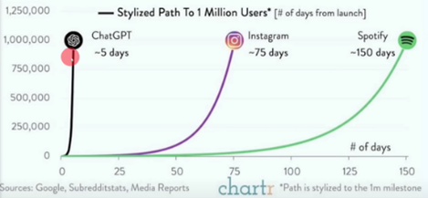

### 머신러닝의 발전 과정
- 현대까지의 모든 인공지능은 데이터를 보고, 패턴을 학습하는 과정을 거칩니다.
- 강화학습도 결국 환경의 데이터와 해당 환경에서의 평가를 보고 학습 하게 되므로
- 모든 것은 전부 데이터를 보고 / 패턴을 학습하는 것입니다.
- 사실 이것은 인간도 마찬가지입니다.
- 처음에는 단순한 수학적 선형 모델이였지만, 비 선형 데이터들을 다루기 위해 진화해 왔습니다.

### Perceptron
- 인공 신경망의 시작점
- 프랑크 로젠블라트(Frank Rosenblatt)가 1957년에 제안한 초기 형태의 인공 신경망
- 다수의 입력을 받아서, 하나의 결과를 내보내는 알고리즘 입니다.
- 수식으로 간단하게 output = w1a1 + w2a2 + w3a3 + ... + bias
- 의 형태를 따릅니다.

- 인간의 뉴런을 수학적으로 흉내낸 모델입니다.
- 이 신경망의 문제는 비선형 문제를 풀지 못한다는 문제가 있습니다.
- XOR Problem 이라고 하며, 이러한 문제를 풀지 못해서, AI 겨울을 맞이합니다.

- 직선 하나로, 빨간 공과 파란 공이 분리되는 공간을 만들 수 없습니다. 이것이 xor problem 입니다.

### 1차 AI 겨울
 - Perceptron 의 등장으로 기계가 학습할 수 있다는 열풍이 불었지만
 - XOR 문제를 해결하지 못한다는 한계가 바로 밝혀졌습니다.

 - 단일 Perceptron 은 선형 분리만 가능했기 때문입니다.
 - 이 한계는 수학적으로 증명되었고, 연구 열기는 식었습니다.

 ## AI의 재기
 
 ### Multi Layer Perceptron
  - 1986년 제프리 힌튼 교수는 Multi-Layer 를 사용한 Perceptron 과 Back Propagation 이라는 알고리즘을 사용하여
  - 해당 심층 신경망을 학습시킬 수 있다는 것을 보여주며 XOR 문제를 해결해버립니다. (이 공로로 노벨 물리학상을 2024년 수상하게 됩니다.)

  - 각 퍼셉트론 층 사이에 활성함수라는 비 선형 함수를 넣으면서, 비선형 함수를 학습 가능하게 하였습니다.
  - 다만 신경망이 부활했지만 또 겨울이 찾아오는데...

  ### 2차 AI 겨울
  - 신경망은 부활 했지만 컴퓨터 자원과 데이터에는 여전히 한계가 있었습니다.
  - 전문가 기반이라는 if문을 떡칠한 규칙기반 AI가 잠깐 인기를 끌었지만
  - 너무 많은 전문가의 리소스를 사용해야하고, 현실 세계의 복잡성을 다 담아내기에는 무리가 있었습니다.
  - 또한 Back Propagation 에서 전파 할 수록 기울기가 소실되는 Vanishing Gradient 라는 문제까지 있어서, 신경망의 크기도 일정 이상 키울 수 없었습니다.

  이러한 이유로 또 겨울이 옵니다. 이 빌어먹을 분야는 옛날에는 맨날 겨울이였습니다.

## 부활

### AlexNet (2012)
 - GPU 를 사용한 병렬 연산이라면, 기존의 학습 방식을 효과적으로 빠르게 할 수 있고, 대규모 데이터셋 (ImageNet) 을 사용
 - 기울기 소실 (Vanishing Gradient) 은 ReLU 를 도입함으로써 해결하게 되었습니다.
 - 2012년 ImageNet 대회에서 2위보다 10%나 적은 오류를 뱉어내며 우승하게 되었습니다.
 - 제프리 힌턴 교수님, 알렉스 크리제프스키, 일리야 수츠케버 등이 참여하여 설계 한 모델입니다.

 - 이 사건을 계기로 딥 러닝이 가능하다는것을 알게 되면서 딥러닝의 시대가 시작 됩니다.

 ### Alpha Go (2016)
 - 알파고의 경우 이전부터 개발중이였지만, 2016년 3월 이세돌 9단을 꺾으면서 바둑이 인간을 넘음으로써, 인공지능의 발전 상황에 대해 사람들에게 놀라움을 주었습니다.
 - 알파고는 초기 버전은 인간 기보를 학습 한 뒤, 강화 학습을 적용하였지만
 - 후기 Go 버전은 스스로 바둑을 배워서 가장 높은 곳에 올라갔습니다.
 - 이 사건을 통해 인공신경망은 크기가 충분히 크고, 데이터만 충분하다면 특정 분야에서 최상위에 있는 인간마저 상회할 수 있다는 것을 대중들에게 크게 각인 시키게 됩니다.

 ### ChatGPT (2022)
 - 기술 자체는 2017년 Attention is All you need! 라는 논문에서 이미 소개가 되었지만
 - 해당 구조에서 따온 Decoder 를 적층하여, 생성에 집중하는 모델을 소개함으로써 대중에게 또 한번 충격을 주었습니다.
 - 현재는 이 당시 22년 11월 30일에 나왔던 모델을 8B 모델들도 쉽게 추월하지만 이 당시 대중들에게 주었던 충격은 어마어마한 수준이였고
 - 그 당시 ChatGPT 의 가입자 수는 인터넷 역사상 유래없을 정도로 아주 빠르게 상승하였습니다.

 

 
 ### 필자의 AI에 대한 생각

 현재는 Suno, Sora 등등 이미지와 영상, 음악을 만드는 AI가 상용화 되어 있고, 더 이상 사람들은 AI의 능력을 무시하지 않고 있습니다.
 다만 AI의 능력에 대해서 또 너무 고평가 하지 않고, 두려워 하지 않았으면 좋겠습니다.
 AI에 대해서 충분히 배우고, 이것을 활용하여서 정말 땅에 무수히 떨어져있는 기회를 주울 수 있으면 좋겠습니다.
 그리고 이 강의가 그런 기회를 잡을 수 있는 초석이 되었으면 좋겠습니다.

 ### 마치며

위에서 소개한 사건들 외에도, 인공지능의 발전에는 수많은 전환점들이 존재합니다.
기술은 어느 날 갑자기 ‘뚝’ 하고 생겨난 것이 아니라,
그 이전 세대의 연구와 실패, 그리고 축적된 기술 위에 쌓인 결과물입니다.

ChatGPT 역시 단독으로 탄생한 기술이 아닙니다.
Attention은 LSTM에서,
LSTM은 Seq2Seq(Sequence-to-Sequence) 모델에서,
Seq2Seq는 신경망 기반 대화 모델의 시도에서,
그 신경망은 구(Phrase) 단위 언어 분석 연구에서 비롯되었습니다.

즉, 하나의 기술 뒤에는 수십 년의 아이디어와 시행착오의 역사가 숨어 있습니다.

이렇듯, 우리가 사용하는 AI 기술 하나하나가
모두 의미 없는 연구의 결과가 아니라, 모두 다음 단계를 위한 디딤돌이었습니다.

이 강의에서는 그 흐름을 따라가며
직접 모델을 구현하고 실험해보며,
프로그래밍과 머신러닝의 원리를 함께 이해해볼 것입니다.