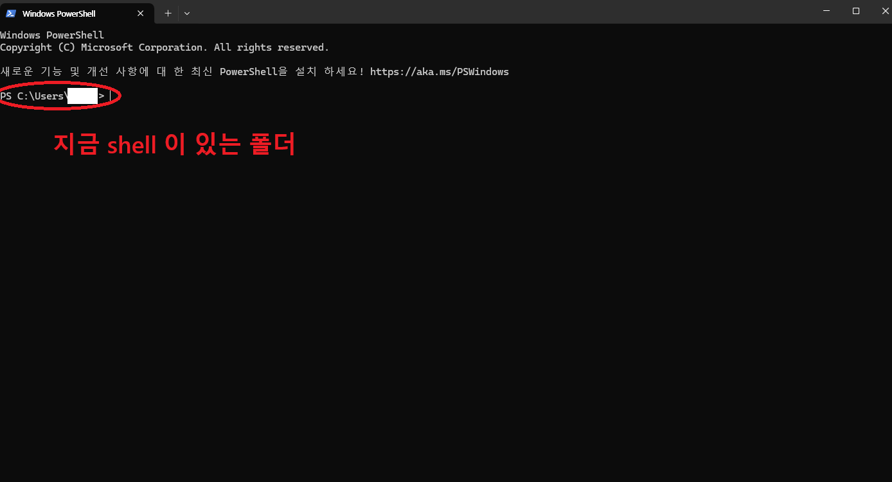
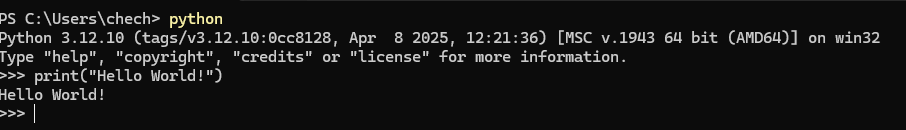

### shell 기본 설명
 - 여기서는 windows 는 PowerShell 을 기준으로 설명합니다. (cmd X)
 - 리눅스 bash 도 리눅스 버전별로 조금씩 다르지만, 여기서 설명할 정도의 명령어는 차이는 없습니다.


### Shell 이란?
 - Shell 은 컴퓨터에게 `명령어로` 말하는 창을 의미합니다.
 - 아닐수도 있는데 대충 이렇게만 받아들여도 됩니다. 전공도 아니고.
 - 즉 Text 형식으로 명령을 입력하는 인터페이스라고 보면 됩니다.
 - 저희가 평소에 사용하는 그래픽 기반을 GUI (Grapic User Interface) 이고
 - 이러한 Text 기반을 CUI (Console User Interface) 라고 합니다.
 - GUI 로 작업을 할 수도 있고, 시각화의 경우 GUI로 보기도 하지만, CLI 에도 역시 익숙해질 필요가 있습니다.
 - 대부분의 많은 작업들 (가상환경을 만든다던지, git 으로 작업한다던지 할땐 CLI 가 압도적으로 편리합니다.)


### Windows CMD / PowerShell / Git Bash / Linux Bash
 - 우선 Windows 는 최근 버전이면 CMD 와 PowerShell 은 모두 있습니다.
 - Git Bash 는 Git 을 설치하면 따라오고
 - Linux Bash 는 Linux 라면 기본적으로 존재합니다.

 | 종류             | 운영체제  | 특징                                              |
| -------------- | --------- | ----------------------------------------------- |
| CMD        | Windows   | 가장 오래된 기본 Shell. 기능이 매우 제한적. 그리고, 명령어도 많이 다름.    |
| PowerShell | Windows   | CMD보다 강력하고 최신. Windows 에서 사용할 것이라면 기본 Shell로 적합.   |
| Git Bash   | Windows   | Linux Bash 명령어를 Windows에서 사용 가능. 개발자가 많이 사용... 하지만, Windows 기반 작업을 많이 한다면 PowerShell 도 역시 알아야 함. |
| Linux Bash | Linux/Mac | 개발 표준 Shell. 리눅스 환경에서 가장 널리 사용 (이라기 보단 선택지가 없음) |

 - 이런 이유로, 이번 프로젝트에선 PowerShell 을 사용합니다.
 - Mac / Linux 사용자라면 기본 터미널을 사용해도 거의 대부분의 명령어는 동일하니, 걱정하지 않으셔도 됩니다.


 ### Shell 기본
  - 우선 PowerShell 을 켜면...
  - 
  - 
  - 와 같은 화면이 보이게 됩니다.
  - 여기서 빨간 동그라미로 친 곳이, 해당 Shell 이 현재 위치 한 곳 입니다.
  - Shell 은 명령어를 항상 현재 위치를 기준으로 실행합니다.
    - 그렇기 때문에 이 위치가 어디인지 항상 잘 봐 두어야 합니다.
    - 보통 Shell 에서 명령어 실행이 되지 않는다면, 현재 위치가 잘 못 되었거나 혹은 설치되지 않은 프로그램이 있거나, 환경변수 등록이 되지 않은 경우입니다.
    - 환경변수에 대한 설명은 다음에 드리겠습니다. 

### Shell 명령어
  - 아래 5개 명령어는 CMD 를 제외하고, PowerShell, Git Bash, Linux (Mac) Bash 에서 모두 동작합니다.
  - pwd: 현재 위치가 어디인지 절대경로로 보여줍니다.
  - ls: 현재 내가 있는 폴더에 어떤 파일들이 있는지 보여줍니다.
  - cd: `cd {folder_name}` 과 같은 식으로 작성해서 해당 폴더로 있는 곳을 이동합니다.
  - mkdir: `mkdir {folder_name}` 으로 새 폴더를 만듭니다.
  - clear: 현재 떠 있는 모든 텍스트를 지우고 깨끗하게 만듭니다.

  가장 간단하게 많이 쓰는 명령어들이고, 훨씬 많은 명령어들과, 많은 옵션들이 존재하지만 일단은 이정도만 알아도 될 것 같습니다.
  - 참고로 Windows 의 경우 `C:\Users\{마이크로소프트 아이디 앞5글자...}\Desktop` 이 바탕화면입니다.
    - 처음 PowerShell을 켰을때 `C:\Users\{마이크로소프트 아이디 앞5글자...}` 의 위치에 있을거에요.
  

### Shell 에서 Python 실행하기
 - Python 을 설치하였다면 Python (혹은 경우에 따라서 Python3 등등...) 을 입력하면, Python을 콘솔에서 바로 사용할 수 있습니다.
 - 우리가 실제로 사용하는 Python {파일이름} 도 파일을 한 줄씩 읽어가면서 실행하는것에 불과합니다.
 - 그래서 기능상으로는 동일하고, 간단하게 무엇인가를 확인 해 볼때 쉽게 사용 할 수 있습니다.
 - 
 - 또한 Python 에서 나오는 방법은 `exit()` 를 입력하거나 `Ctrl + z 입력 후 Enter` 로 나올 수 있습니다.
 - Python 내에서는 Python 을 입력받고 있기 때문에 Shell 명령어는 입력받을 수 없습니다.


 ### Python 파일을 직접 실행 해 보자.
 - 우선 아래 코드를 텍스트 파일에 쓴 뒤 `sample.py` 로 저장하세요.
  ```python
    test = [5,3,2,4,1,9,6]
    print(test)
    test.sort()
    print(test)
  ```
 
 - 그 뒤 해당 파일이 있는 디렉토리로 이동 한 뒤
 - `python sample.py`
 - 로 실행 해 보세요
 - 
 - 위와 같은 결과가 나오면 성공입니다.


 ### 우선...
  - 이 정도 Python을 CLI 환경에서, 파일을 읽을 수 있고, 몇 가지 Shell 명령어만 알아둬도 당장 학습 하는데는 문제 없습니다.
  - 필요한 명령어는 그 때 그 때 새로 또 배워나가면 됩니다.