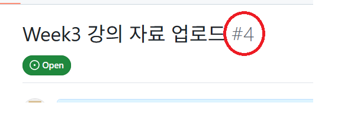

### git 은 왜 필요한가?
 - 프로젝트의 버전을 기록
 - 여러 상태로 안전하게 돌아갈 수 있음
 - 여러명이 동시에 작업 가능
 - windows 용 다운로드는 https://github.com/apps/desktop?locale=ko-KR 여기서

### github 간단한 기본
 - 우선 Repo를 만드는것 보다, 있는 repo를 복사해서 코드를 수정하고 올리는 과정을 먼저 진행 해 볼 것 입니다.
 - 깃 메인 화면을 보면
 - 
 - 를 클릭하면, 복사할 주소가 바로 저장이 됩니다.
 - 그 상태에서 `git clone {복사한 주소}` 명령어를 입력하는 것으로, 자신이 현재 있는 디렉토리에 해당 저장소를 받아올 수 있습니다.

### Branch 를 나누어 보자
 - master / main 에 있는 코드는 항상 정상 동작 해야 합니다.
 - 그렇기 때문에 새로운 기능은, master나 main 이 아닌곳에서 작업 해야 합니다.
 - 
 - 해당 버튼을 눌러서, 간단하게 issue를 작성 하고 나면
 - 
 - 위와 같이, 이슈 번호가 적히는데요
 - `git branch` 명령어로 현재 자신이 있는 branch 를 볼 수 있습니다.
 - 
 - branch를 새로 만들때는 `git branch {branch 이름}`
 - branch 이름을 바꿀 때는 `git branch -m {바꿀 이름}`
 - branch 이동은 `git checkout {branch 이름}` 으로 이동할 수 있고,
 - 새로운 branch를 만들면서 바로 이동하려고 할 때는 `git branch checkout -b {branch 이름}` 으로 만들면서 이동이 가능합니다.

### 변경 내용을 저장하고, 업로드 하기
 - branch 내에서 코드를 업데이트 했다면 `git add` 명령어를 이용해서, 파일의 변경 사항을 기록할 수 있는데요
 - `git add {변경된 파일}` 이 됩니다.
 - 여기서 `git add .` 을 하면, 내가 지금 있는 디렉토리부터, 모두 재귀적으로 추적하게 됩니다.
 - 그 다음 `git commit -m "[#{feature_번호}] 간단한 커밋 명"` 으로 commit 을 작성 한 뒤
 - git push {올릴 권한명} {올릴 branch 명} 으로 업로드 하면 됩니다.
 - 위와 같이 업로드 하면

