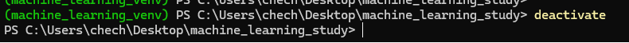

### Python 가상 환경
 - Python 을 프로젝트 단위에서 안정적으로 사용하기 위해서는
  - Python 을 어떤 레벨에서, 어떻게 관리하는 도구인지를 먼저 이해하는것이 좋습니다.
  - 공식적으로 어떤 규칙이 있는건 아니고... 그냥 제가 생각했을 때 아래와 같은 레벨로 나눌 수 있을 것 같네요
    - Global Level
      - 이 단계에서는 Python 버전 자체를 관리합니다.
      - python:3.12, python:3.11 등과 같이 Python 버전을 일단 다르게 쓸 수 밖에 없을 때, 사용해야합니다.
      - 한 시스템에 여러 파이썬 버전을 설치하는것이 굉장히 힘들기 때문입니다.
    - Local Level
      - 이 단계에서는 프로젝트별로 가상환경을 분리합니다.
      - 같은 python 버전을 사용하지만, A 프로젝트와 B 프로젝트에서 사용하는 라이브러리 버전이 다를 경우
      - 해당 설정을 global 로 설치하게 되면 환경이 꼬일 가능성이 높습니다.
      - 안정적으로 사용하려면 무조건 가상환경으로 격리하는 것이 좋습니다.
    - Package Level
      - 라이브러리의 버전을 관리합니다.
      - 한 프로젝트 내에서, 라이브러리의 버전은 고정될 필요가 있습니다.
      - 이 프로젝트를 구동하기 위해서, 어떤 라이브러리를 사용해서 개발했는지 명시할 때 필요 합니다.
    - 보통은 Global Level 을 지원하면, 하위 Level 은 모두 지원 합니다.
    - 하위 Level 을 지원한다고 Global Level 을 지원하는 것은 아닙니다.
    - 문제는 Global 에 해당하는 Tool 들은, 기업용으로 사용할 때는 유료인 Tool 들도 많아서, 간단한 것들도 익혀서 사용하는것이 좋고
    - 또한 설치의 복잡성, 관리의 복잡성 문제가 있어서, 여기서는 Local + Package 만 사용하도록 하겠습니다.

### Global Level Tools
 - pyenv
  - 여러 Python 버전 설치 / 전환 을 지원 합니다.
  - 프로젝트별로 파이썬 버전을 다르게 가져갈 수 있을 때 쉽게 사용할 수 있습니다.
  - 특정 버전의 파이썬 버전도 아주 쉽게 받을 수 있습니다.
  - 대표적인 Python 버전 관리자 입니다.
  - 가상환경도 만들 수 있지만, 그것은 pyenv 의 서브기능정도 인것 같습니다.

- conda / miniconda / anaconda
 - Python 배포판 + python 버전 관리 + 가상환경 + 패키지관리 까지 모두 통합 되어 있습니다.
  - 자신이 원할 때, 해당 conda 환경에 어떤 라이브러리가 설치되어있는지 가장 빠르게 export 할 수 있습니다.
 - 단점은 세 가지 정도 있는데
   - 무겁고 느립니다.
   - 기업용으로는 사용하기 조금 어렵습니다. (라이선스 비용이 들어갑니다.)
   - pip (uv) 에 올라와있는 것들이 간혹 올라와있지 않습니다;;

- uv (신규)
 - Python 설치 + 패키지 관리 + 가상환경 제공
 - 정말 빠릅니다. (Rust 기반, pip 의 대체제로써도 각광 받음)
 - 아직 참고할 자료가 위 두가지보다 많지 않다는 흠이 있습니다 (2024년 오픈, 해당 글 작성은 25년 11월에 이루어졌습니다.)

### Local Level Tools
 - Python version 은 그대로 사용하고, 프로젝트별로 별도 환경을 만들어서 global 환경이 오염되지 않도록 함.
  - venv (python 기본 제공)
  - 가장 단순하고 기본적인 가상 환경
  - `python -m venv {virtual_env_name}` 으로 생성 가능
  - 각 프로젝트별로 독립된 라이브러리 설치 가능
  - 의존성 충돌 해결 기능이 따로 있는것은 아님. (당연하게도 그냥 라이브러리의 참조위치만 바꾸는 기능을 함.)
  - 그렇기 때문에 venv 를 사용할 때는, Package Level 의 Tool들을 같이 사용해 주는 것이 좋습니다.

### Package Level
 - pip + requirements.txt
  - 가장 기초적인 방식
  - `pip install` 로 설치 `pip freeze > requirements.txt` 로 현재 세팅 고정 가능.
  - dependency 충돌 조정이 어렵다 (A라이브러리와 B라이브러리가 참조하는 다른 라이브러리의 버전이 상충된다던가 하는...)
  - 그리고 버전 고정을 까먹거나, 라이브러리 이름만 적어서 기록하거나 하는 등의 문제가 있어서, 재현성이 낮음
  - 아래쪽의 poetry 는 `poetry.lock` 파일이 생성되는데, 해당 파일에 버전이 항상 명시되어있습니다.
    - 물론 `pyproject.toml` 은 사람이 작성하니까, 버전이 명시 안 돼있을수도 있지만...

 - poetry
   - 일단 poetry 자체는 pip로 설치해야 하지만... `pip install poetry`
   - 이렇게 설치된 poetry 를 사용해서, dependency 관리를 할 수 있음.
   - 설치해서 써야한다는거랑, 사용법을 익혀야 한다는 점을 제외하고는 `pip + requirements.txt` 의 방식에 비해 모든 면에서 우위를 차지함.

### 여기서 사용할 방식은?
 - `venv` + `poetry` 사용
   - global 환경을 건드리지 않아서 안전함.
   - 추가적인 라이선스 문제에 고민하지 않아도 됨
   - 시스템 환경도 더럽히지 않음
   - 다만 venv 를 사용하면서 용량증가가 조금 더 있겠지만. 다른 Tool들을 사용했더라면 더 무거웠을 것.
   - `poetry` 를 사용해서 패키지 버전 관리
     - 추후에도 재현성을 확보하기 쉬움.
   - 그리고 많이 사용되는 방식이기도 하고, 이걸로 재현성을 확보한 자료들은 다른 자료로 확보한 자료에 비해서 접근성이 우월하다.
     - 사실상 python 만 설치되어있으면 거의 바로 해 볼수있는 수준
     - uv 의 편의성을 생각하면 uv 정도는 따라올만 하다고 보지만, uv 는 아직 생태계 성장중이기 때문!

### Python venv 생성하기 전에...
 - shell 설명은, 같은 주차의 `shell_explain` 을 참조하세요.
 - 여기서는 shell 에 대해서는 이미 알고있다고 가정합니다.
 - 또한 Python 의 설치에 대해서는 설명하지 않습니다.
 - Python 설치는 공식 홈페이지를 참조하세요.
 - Python 을 설치 한 이후, Shell 명령어를 사용해서 Python 이 기동되는 상태에서 아래의 내용을 수행 할 수 있습니다.

### python venv 만들기
 - `python -m venv {생성할 환경 이름}` 으로 생성 합니다.
  - linux 계열에서는 이렇게 생성된 폴더에서 `. 환경이름/bin/activate` 로 해당 환경을 실행 가능하며
  - Windows 계열에서는 `. 환경이름/Scripts/activate` 로 환경을 실행 가능합니다.
  - 환경이 실행되면 아래 그림처럼
  - 
  - 명령창 앞에, 가상환경의 이름이 노출됩니다.
  - 여기까지 하면 가상환경을 사용할 준비는 끝났습니다.
  - 가상환경에서 나가고 싶다면 단순히 `deactivate` 를 입력하면 됩니다.
  - 
  - 이렇게 가상환경에서 나올 수 있습니다.

### poetry 설치 및, poetry 로 환경 관리
  - poetry 설치도, python 가상환경 내에서 진행 해 주세요. (poetry 자체도 global 설치 시 버전 꼬임이 있을 수 있음.)
  - `pip install poetry` 로 설치 가능합니다.
  - 설치가 완료되었다면 `poetry --version` 으로 버전을 확인 해 주세요.
  - 위 명령어가 정상적으로 실행되어, 버전이 나온다면 성공.
  - 이번 프로젝트에서는, 제가 구성한 환경을 통해서 실험을 진행 할 예정이지만, poetry 를 사용할 때 기본적인 지식은 전달 드리겠습니다.
  - `poetry init`
   - 위 명령어는 poetry 환경울 초기화 할 때 사용합니다.
   - 여러 질문이 나오는데 그냥 전부 enter 치고, 기본값을 사용해도 무방합니다.
  - `poetry add {package name}`
   - 위 명령어를 통해서, 원하는 패키지를 추가할 수 있습ㄴ디ㅏ.
   - poetry 는 `pyproject.toml` 파일과 `poetry.lock` 파일 두 가지를 사용해서 버전을 관리합니다.
   - `pyproject.toml` 은 어떤 라이브러리를 사용하는지 기록
   - `poetry.lock` 라이브러리를 어디서 받아왔고, 어떤 버전을 사용하는지 기록
   - 위 두가지를 사용해서 동일한 환경을 재현합니다.
  - poetry 역시 내부적으로 자체 가상환경을 만들 수 있지만, 기존 venv 를 사용하면 되니 그 것을 그대로 사용합니다.
  - venv 를 사용한 상태라면 그냥 python 을 실행하는것으로 문제 없습니다.
  - 또한 이미 있는 `pyproject.toml` 파일과 `poetry.lock` 이 포함된 레포를 받았다면
  - `poetry install` 로 해당 poetry 에 기록 된 라이브러리를 전부 해당 환경으로 받아올 수 있습니다.
  - 그외에 poetry 의 경우, 버전을 올릴 때 `poetry.lock` 을 새로 작성 해 주어야 하는데
  - `poetry lock --no-update` 등을 통해 가능하지만, 이는 추후 다시 필요시에 언급토록 하겠습니다. 우선은 그냥 poetry 를 사용해서 버전 관리가 된다는것만 이해하면 됩니다.
 